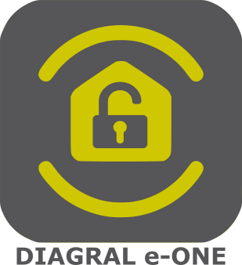

# Présentation 

Diagral est un constructeur français d'alarme, appartenant au groupe HAGER :
[https://www.diagral.fr/qui-sommes-nous](https://www.diagral.fr/qui-sommes-nous)

Les nouvelles alarmes Diagral sont sous l'appellation e-ONE.
Par cette appellation, Diagral entre dans l'ère des alarmes connectés au travers d'une application portant le même nom.

Ce plugin Jeedom vous permet d'interragir avec votre alarme Diagral e-ONE au même titre que l'application officielle.

# Principe 

Diagral propose uniquement une méthode Cloud d'interraction avec votre alarme (au travers de la Box E-One DIAG56AAX), par conséquent ce plugin utilise une connexion internet pour interragir avec votre alarme.

C'est donc une interface __CLOUD__

# Equipements supportés

- Centrale d'alarme (DIAG91AGFK)
- Détecteur à images (DIAG29AVX)
- Commandes / Transmetteurs / Sensors / Sirenes __FONCTIONNALITE DISPONIBLE UNIQUEMENT EN BETA A PARTIR DE v2.3.0__
- Camera __FONCTIONNALITE DISPONIBLE UNIQUEMENT EN BETA A PARTIR DE v2.2.0__
- Motorisation Portail Adyx __FONCTIONNALITE DISPONIBLE UNIQUEMENT EN BETA A PARTIR DE v2.1.0__
- Motorisation Garage Adyx __FONCTIONNALITE DISPONIBLE UNIQUEMENT EN BETA A PARTIR DE v2.3.0__
- Module KNX Light (DIAG65AVX) __FONCTIONNALITE DISPONIBLE UNIQUEMENT EN BETA A PARTIR DE v2.3.0__
- Motorisation Volet Adyx __FONCTIONNALITE DISPONIBLE UNIQUEMENT EN BETA A PARTIR DE v2.3.0__
- Module Volet KNX (DIAG66AVX) __FONCTIONNALITE DISPONIBLE UNIQUEMENT EN BETA A PARTIR DE v2.3.0__

# Configuration

## Configuration du plugin

__Le plugin se veut simple (et non simpliste) en utilisation et en configuration__.
Tout ce que le plugin peut récupérer via le Cloud Diagral est fait afin de vous éviter des configurations inutiles et source d'erreurs.

Le plugin comporte une configuration générale.
Vous y saissez les informations suivantes :

-   Identifiant : adresse email utilisée sur l'application mobile Diagral e-ONE (de préférence le compte principal afin de pouvoir déconnecter les autres sessions)
-   Mot de passe : Le mot de passe associé à l'identifiant
-   Nombre de tentatives : nombre de tentatives en cas d'échec de connexion au Cloud Diagral (default : 1)
-   Délai entre les tentatives : délais entre les tentatives (en secondes)
-   Mise à jour automatique (minutes) : Fréquence de mise à jour des informations eOne
-   Nombre de vidéos à conserver : Quantité de vidéos conservé dans Jeedom (pour l'ensemble des équipements supportant le téléchargement des vidéos - ex: détecteur à images)
-   Suivi d'installation (cf chapitre dédié)
-   Verbose : Permettant de définir un niveau de verbosité pour les requètes vers le Cloud Diagral (_Pas encore utilisable_)

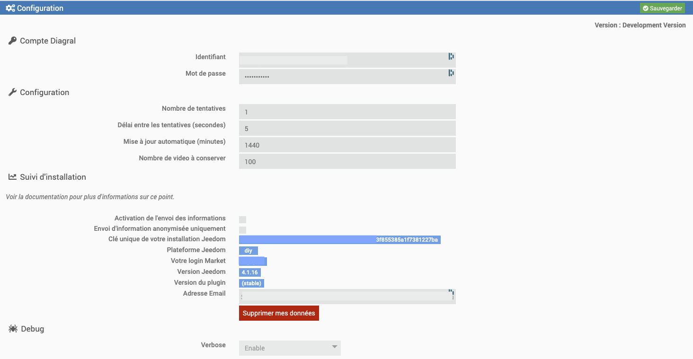

## Configuration d'un équipement

La création de l'équipement se fait de façon automatique. Il vous suffit de cliquer sur Synchronisation dans le plugin, pour que chacun des produits supportés et  configurées et finalisées dans votre compte Diagral, soit créée. Elles sont automatiquement nommées telles que dans l'application Mobile Diagral.

### Configuration - Centrale d'alarme

Une fois le/les alarmes créées, il faut entrer dans chacune d'elles afin de configurer :
-   le __Master Code__ (celui que vous utilisez pour vous connecter à votre alarme avec l'application Mobile Diagral e-ONE).
-   l'objet parent
-   L'activation (optionnelle) de la fonction de sécurisation désarmement
-   La désactivation (optionnelle) du widget Diagral activé par défaut
-   activer l'équipement

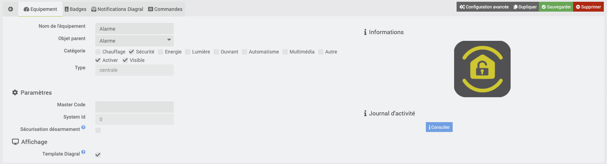

> Une fonctionnalité de sécurisation du désarmement (SecureDisam) est disponible avec l'option __Sécurisation désarmement__.
> 
> Cette fonctionnalité permet si elle est activée (case cochée) d'empêcher le désarmement de l'alarme au travers de Jeedom.
> Les commandes sont cependant toujours présente mais bloquée.
> 
> Cette fonctionnalité ne prend de sens que pour empêcher la désactivation de l'alarme à un compte _Utilisateur_ ou _Utilisateur limité_ Jeedom. Par exemple, pour une tablette qui déporte l'affichage de votre Jeedom. En tant qu'administrateur, même si la fonctionnalitée SecureDisarm est active, elle est outre-passée.

Lors de la sauvegarde, de nouvelles commandes vont se créer car elle nécessitent le MasterCode (ex : _Activation Partielle ou Lancement Scenario_).

Ces commandes sont en fait les commandes qui permettent d'avoir une liste déroulante dans les scénarios. Ainsi le plugin va personnaliser les listes déroulantes avec les informations présentes sur votre compte.

### Configuration - Détecteur à Image 

Aucune configuration particulière à effectuer ici. L'équipement est créé de façon automatique et est actif après une synchronisation.

Seul une options est configurable 'Video Auto Download' qui permet au plugin de télécharger de façon automatique les vidéos disponibles (des vidéos de 5 secondes) selon la politique de retention (cf. chapitre Configuration du plugin).

> Le téléchargement des vidéos se fait lors du rafraichissement automatique (cf. chapitre Rafraichissement > Automatique).
> Il est recommandé de ne pas avoir une fréquence trop rapide pour eviter de se faire blacklister par Diagral

Les vidéos sont visibles via la page de l'équipement en cliquant sur le bouton __Consulter__ dans __Liste des vidéos disponibles__

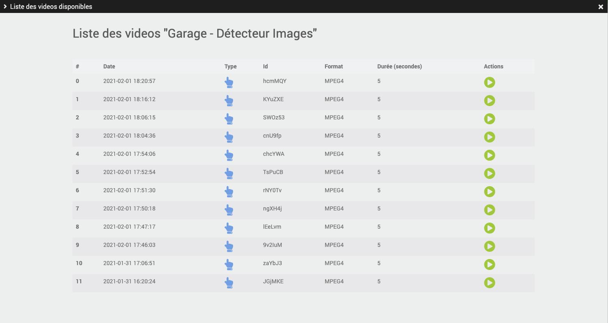

### Configuration - Commandes / Transmetteurs / Sensors / Sirenes

> __FONCTIONNALITE DISPONIBLE UNIQUEMENT EN BETA A PARTIR DE v2.3.0__

Aucune configuration particulière à effectuer ici. L'équipement est créé de façon automatique et est actif après une synchronisation.

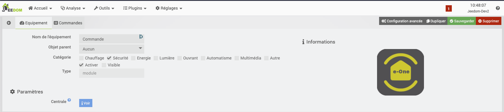

### Configuration - Camera

> __FONCTIONNALITE DISPONIBLE UNIQUEMENT EN BETA A PARTIR DE v2.2.0__

Une camera Diagral se comporte visuellement et d'un point de vue configuration comme un Détecteur à Image.
Cependant, il est uniquement possible de consulter les videos prises.
Diagral utilise le service EzViz pour piloter les cameras mais rien n'est documenter et cela ne transite pas en HTTP(s) donc je ne peux pas faire de reverse engineering dessus.

Cependant si certain ont des idées, je suis preneur.

### Configuration - Motorisation Portail Adyx

> __FONCTIONNALITE DISPONIBLE UNIQUEMENT EN BETA A PARTIR DE v2.1.0__

Aucune configuration particulière à effectuer ici. L'équipement est créé de façon automatique et est actif après une synchronisation.

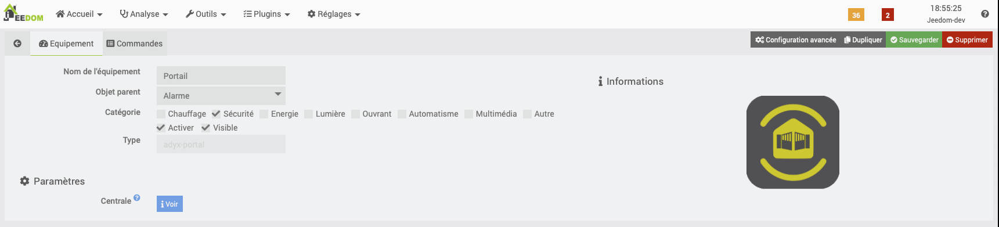

### Configuration - Module Garage Adyx

> __FONCTIONNALITE DISPONIBLE UNIQUEMENT EN BETA A PARTIR DE v2.3.0__

Aucune configuration particulière à effectuer ici. L'équipement est créé de façon automatique et est actif après une synchronisation.

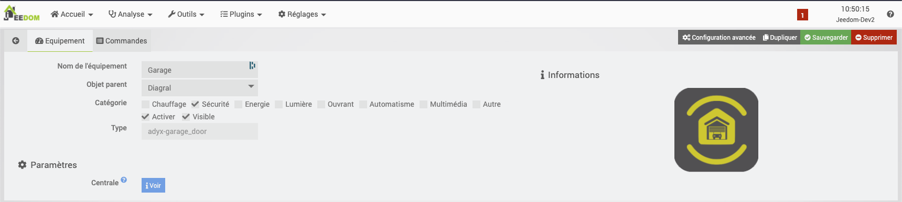

### Configuration - Module KNX Light

> __FONCTIONNALITE DISPONIBLE UNIQUEMENT EN BETA A PARTIR DE v2.3.0__

Aucune configuration particulière à effectuer ici. L'équipement est créé de façon automatique et est actif après une synchronisation.

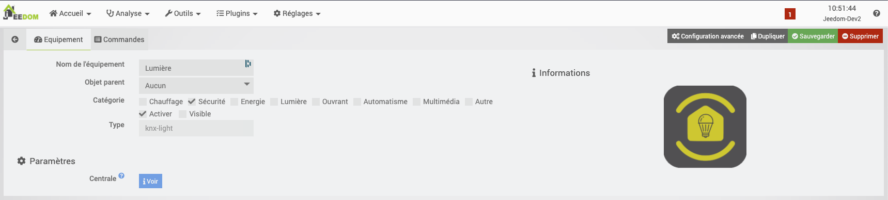

### Configuration - Motorisation Volet Adyx

> __FONCTIONNALITE DISPONIBLE UNIQUEMENT EN BETA A PARTIR DE v2.3.0__

Aucune configuration particulière à effectuer ici. L'équipement est créé de façon automatique et est actif après une synchronisation.

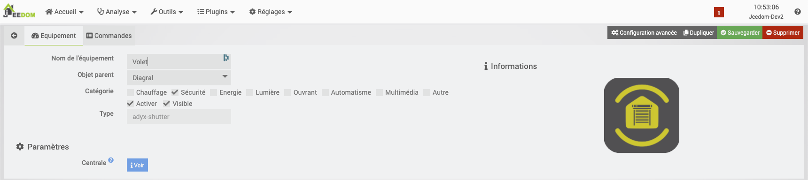

### Configuration - Module Volet KNX

> __FONCTIONNALITE DISPONIBLE UNIQUEMENT EN BETA A PARTIR DE v2.3.0__

Aucune configuration particulière à effectuer ici. L'équipement est créé de façon automatique et est actif après une synchronisation.

# Déclenchement d'alarme

Le plugin peut détecter un déclenchement d'alarme a condition qu'il recoivent l'information par MAIL ou SMS (cf chapitre dédié à la reception des mail ou sms Diagral)

> __FONCTIONNALITE DISPONIBLE UNIQUEMENT POUR LES RECPETIONS EMAILS__

Une commande info binaire ("Alarme déclenchée") existe pour récuperer le statut de l'alarme. Vous pouvez ainsi l'utiliser dans un scénario pour lancer des actions (notification ou baisser les volets par exemple).
Cette commande info à 2 valeurs possibles :
-   0 : Aucune alarme déclenchée
-   1 : Une alarme en cours

Le statut de l'alarme repasse à 0 automatiquement lorsque le plugin detecte soit que :
-   l'alarme est désormais désactivée
-   l'alarme n'est plus active pour la zone qui a déclenché l'alerte (armement partiel)

# Alias de Badge

Vous pouvez définir dans l'équipement (onglet Badges), des alias sur un maximum de 8 Badges.

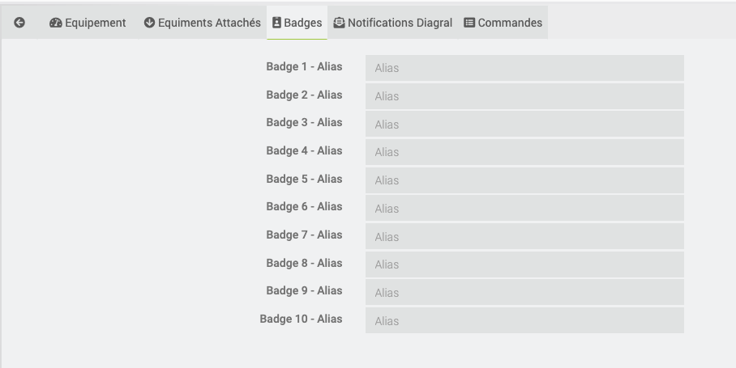

Lorsque vous recevez un email d'activation ou désactivation au travers d'un badge, il n'indique pas d'utilisateur. Afin de faciliter l'usage, cette fonctionnalité permet d'ajouter un alias à un badge qui sera positionné dans la commande __IMPORT - Dernier utilisateur__ au même titre que ce champs est rempli lorsque qu'un utilisateur active ou désactive l'alarme via l'application Diagral ou son code personnel.

# Rafraichissement

## Automatique

Une tâche CRON est automatiquement créée sur base du délai entre les tentatives indiqué dans la configuration du plugin.

## Manuel

Dans un scénario, vous pouvez utiliser la commande __Rafraichir__ afin de reforcer un refresh de l'alarme.

## Webhook

Un webhook est disponible au sein du plugin pour forcer un rafraichissement a partir de solution tierces comme Macrodroid ou tout autre produit en mesure de faire un requete WEB sur la reception d'une notification de l'application Diagral eOne.
Le webhook doit être appellé dans le format 

> http(s)://<jeedom-vhost>/plugins/Diagral_eOne/core/php/webhook.php?apikey=<apikey>&action=refresh&eq=<eqId>

Les paramètres sont :
- __apikey__ : Clé API du plugin Diagral (visible dans la configuration du plugin) - OBLIGATOIRE
- __action__ : Doit contenir 'refresh'. Peut être que d'autres seront disponible plus tard - OPTIONNEL : si non précisé cela appliquera un refresh
- __eq__ : Doit contenir l'ID de l'équipement sur lequel appliqué l'action - OPTIONNEL : si non précisé, cela mettra à jour tout les équipements (comme la CRON)

## A réception d'un Email ou SMS

> _Diagral a indiqué qu'ils n'enverraient plus de notification Mail lors d'une activation/désactivation de l'alarme. Cette méthode deviendra donc obsolète pour forcer un rafraichissement dès lors qu'il appliquerons cette décision._

Le plugin permet de recevoir des informations non disponibles par l'API (utilisateur intervenu, déclenchement d'alarme, etc...) au travers d'Email ou SMS.
Le plugin ne gère pas la collecte Email ou SMS. Il faut donc utiliser un autre plugin pour transmettre le message au plugin.
La commande utilisée pour recevoir le message est __Importer Message__

> Actuellement, seul les plugins suivants sont officillement supportés :
> - [Mail Listener](https://www.jeedom.com/market/index.php?v=d&p=market&author=lunarok&&name=Mail%20Listener) de Lunarok.
> 
> Si vous validez le fonctionnement avec d'autre plugin, n'hésitez pas à m'en informer par [Github](https://github.com/mguyard/Jeedom-Diagral_eOne/issues/new) ou sur [Community](https://community.jeedom.com/) en ouvrant un new topic taggé avec le plugin.

> Actuellement la gestion des messages Email n'est pas complete
> 
> N'hésitez pas à participer en indiquant les messages non encore gérés afin de les integrer
> Pour cela, il suffit de récupérer le message dans le log _Warning_ généré (cf. Diagnostique pour définir le niveau de log) et d'[ouvrir une demande sur le Github du plugin](https://github.com/mguyard/Jeedom-Diagral_eOne/issues/new?assignees=mguyard&labels=enhancement&template=message---ajout-du-support-d-un-nouveau-message.md&title=%5BMSG-ADD%5D)

### Génération automatique du scénario

> _Fonctionne uniquement avec les plugins officiellement supportés (cf. ci-dessus)_

Dans l'équipement il existe un onglet "Notifications Diagral" qui permet de confiugurer les informations essentielles à la génération du scénario de reception des notifications Diagral.

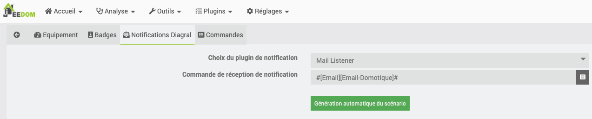

> __Vous devez sauvegarder le choix du plugin et la commande de reception avant de lancer l'éxecution de génération/modification du scénario. Il est possible parfois que le bouton de génération ne s'affiche pas après une sauvegarde, il suffit dans ce cas de changer d'onglet et revenir sur l'onglet de notification.__

Une fois le scénario créé, le nom du scénario existant et la capacité de le modifier/supprimer vous est proposé (__uniquement si il a était créé par le plugin et non manuellement__).

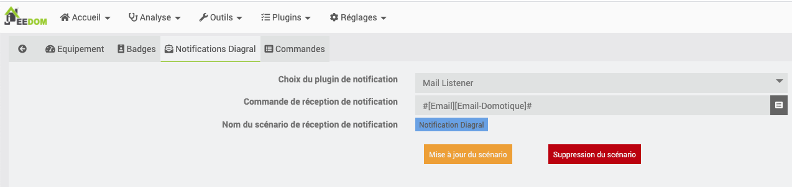

### Génération manuelle du scénario

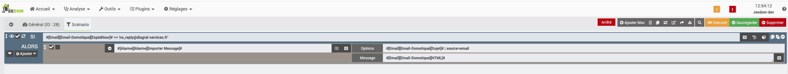

Dans la commande, vous devez avoir :
- dans __Options__
  - Le sujet du message (si vous n'en avez pas comme dans le cas d'un SMS ne pas le mettre)
  - Un "pipe ou barre verticale " qui sert de séparateur (_uniquement si j'ai un sujet avant_)
  - Les arguments
    - source (choix possible : email ou sms)
- dans __Message__
  - Le message reçu

> Si vous avez utilisé la méthode de génération manuelle du scénario, je vous invite a le supprimer et utiliser la méthode de génération automatique. Cela vous permettra dans l'avenir d'avoir la possibilité de le mettre à jour (dans le cas où la release note indiquerait une évolution du scénario)

# Caching

Afin d'éviter de trop requêter les serveurs Diagral, le plugin met en cache les informations suivantes :
-   Les groupes configurés dans l'alarme
-   Les scénarios configurés dans l'alarme

Le cache est regénéré - par une tâche CRON - automatiquement tous les dimanches à une heure définie aléatoirement lors de l'installation.

Vous pouvez forcer la regénération manuellement avec les commandes suivante disponible sur la centrale
-   __Force Groups Refresh__ 
-   __Force Scenarios Refresh__

# Commandes

## Commandes - Centrale 

Il existe actuellement plusieurs commandes qui sont décrites ci-dessous :

### Action

-   __Rafraichir__ : Mise à jour du statut de l'Alarme
  
-   __Désactivation Totale__ : Arrêt de l'alarme

-   __Désactivation Partielle__ : Permet de désactiver un groupe de l'alarme
    -   _La désactivation d'un groupe ne peut être effectuée que lorsque l'alarme est activée (à l'exclusion du mode présence)_

-   __Activation Totale__ : Activation de toutes les zones de l'alarme

-   __Activation Mode Presence__ : Activation avec le mode spécial Présence

-   __Activation Partielle__ : Activation de quelques groupes uniquement.
    -   _Le choix des groupes est définissable uniquement au travers d'une action dans un scénario_
    -   _Lors d'un 'Tester' sur la commande, seul le premier groupe de la liste déroulante (à savoir le moins long) sera executé_

-   __Importer Message__ : Collecte d'un message (mail ou SMS)

-   __Force Groups Refresh__ : Rafraichissement des fichiers de groupes
    -   _Le plugin génère des fichiers JSON (#pluginDirectory#/data/groups_*.json) afin d'éviter d'interroger très regulièrement le cloud Diagral et ainsi éviter de se faire Blacklister temporairement le compte.
    -   Un fichier JSON par équipement. Le * correspond au systemID indiqué sur chaque équipement
    -   Une CRON Diagral_eOne/generateJsonAllDevices se lance tous les dimanches pour mettre à jour ces fichiers (l'heure est définie aléatoirement à l'installation pour éviter les effets de masse sur le Cloud Diagral).

-   __Force Scenarios Refresh__ : Rafraichissement des fichiers de scénarios
    -   _Le plugin génère des fichiers JSON (#pluginDirectory#/data/scenarios_*.json) afin d'éviter d'interroger très regulièrement le cloud Diagral et ainsi éviter de se faire Blacklister temporairement le compte.
    -   Un fichier JSON par équipement. Le * correspond au systemID indiqué sur chaque équipement
    -   Une CRON Diagral_eOne/generateJsonAllDevices se lance tous les dimanches pour mettre à jour ces fichiers (l'heure est définie aléatoirement à l'installation pour éviter les effets de masse sur le Cloud Diagral).

-   __Lancement Scenario__ : Exécute un scénario

### Info

-   Statut : Etat binaire de l'activation de l'alarme
-   Mode : Statut de l'alarme
    -   Off : Alarme désactivée
    -   presence : Alarme en mode présence
    -   group : Alarme activée uniquement sur certains groupes
    -   tempogroup : Alarme en cours d'activation
-   Alarme déclenchée : 1 correspond à une alarme en cours. 0 dans les autres cas
-   Mises à jour disponibles : Indique le nombre de mises à jour disponibles sur l'alarme
-   Groupes Actifs : Liste des groupes actifs par leur nom (ex. Détecteur Ouverture Étage + Garage)
-   IMPORT - Dernier Message : Dernier message reçu par message (mail ou sms)
-   IMPORT - Derniere action : Dernière action reçue par message (mail ou sms)
    -   _Exemple "une mise à l'arrêt à distance"_
-   IMPORT - Derniere methode : Dernière methode reçue par message (mail ou sms)
    -   _Exemple "code d'accès principal"_
-   IMPORT - Dernier utilisateur : Dernière methode ayant intervenu sur l'alarme, reçue par message (mail ou sms)

## Commandes - Détecteur à Image 

Il existe actuellement plusieurs commandes qui sont décrites ci-dessous :

### Action

-   __Déclencher Enregistrement__ : Déclenche manuellement un enregistrement sur le détecteur à image

### Info

-   __Dernière video__ : Retourne le chemin complet de la dernière vidéo téléchargé

## Commandes - Commandes / Transmetteurs / Sensors / Sirenes

> __FONCTIONNALITE DISPONIBLE UNIQUEMENT EN BETA A PARTIR DE v2.3.0__

Il existe actuellement plusieurs commandes qui sont décrites ci-dessous :

### Action

-   __Rafraichir__ : Mise à jour du statut

### Info

-   __Alerte Batterie__ : Binaire qui indique si un defaut de batterie est détecté (0 = NON / 1 = OUI)
-   __AutoProtection__ : Binaire qui indique si un defaut d'AutoProtection est détecté (0 = NON / 1 = OUI)
-   __Radio Alerte__ : Binaire qui indique si une alerte RADIO est en cours (0 = NON / 1 = OUI)
-   __Alerte ADSL__ : Binaire qui indique si une alerte ADSL est en cours (0 = NON / 1 = OUI)
-   __Alerte GSM__ : Binaire qui indique si une alerte GSM est en cours (0 = NON / 1 = OUI)
-   __Alerte Sensor__ : Binaire qui indique si une alerte sur le SENSOR est en cours (0 = NON / 1 = OUI)

Selon le type d'équipement, certaines peuvent être inutiles mais sont retournées par Diagral

## Commandes - Caméra

> __FONCTIONNALITE DISPONIBLE UNIQUEMENT EN BETA A PARTIR DE v2.2.0__

Il existe actuellement une seule commandes [(raisons détaillés ici)](https://mguyard.github.io/Jeedom-Documentations/fr_FR/Diagral_eOne/documentation#Configuration%20-%20Camera) qui est décrites ci-dessous :
### Info

-   __Dernière video__ : Retourne le chemin complet de la dernière vidéo téléchargé

## Commandes - Motorisation Portail Adyx

> __FONCTIONNALITE DISPONIBLE UNIQUEMENT EN BETA A PARTIR DE v2.1.0__

Le portail connecté via Diagral ne remonte pas le statut. Aucune commande info n'est donc créée.

### Action

-   __Ouverture totale__ : Déclenche l'ouverture totale du portail
-   __Ouverture Pieton__ : Déclenche l'ouverture partiel (piéton) du portail

## Commandes - Motorisation Garage Adyx

> __FONCTIONNALITE DISPONIBLE UNIQUEMENT EN BETA A PARTIR DE v2.3.0__

La motorisation Garage Adyx connecté via Diagral ne remonte pas le statut. Aucune commande info n'est donc créée.
### Action

-   __Mouvement__ : Déclenche un mouvement sur la porte de garage (ouvre si garage fermé / ferme si garage ouvert)

## Commandes - Module KNX Light

> __FONCTIONNALITE DISPONIBLE UNIQUEMENT EN BETA A PARTIR DE v2.3.0__

Il existe actuellement plusieurs commandes qui sont décrites ci-dessous :

### Action

-   __Rafraichir__ : Mise à jour du statut
-   __Allumer__ : Le nom est assez parlant
-   __Eteindre__ : Le nom est assez parlant

### Info

-   __Statut__ : Binaire qui indique l'état (0 = OFF / 1 = ON)

## Commandes - Motorisation Volet Adyx

> __FONCTIONNALITE DISPONIBLE UNIQUEMENT EN BETA A PARTIR DE v2.1.0__

Le Motorisation Volet Adyx connecté via Diagral ne remonte pas le statut. Aucune commande info n'est donc créée.

### Action

-   __Ouverture__ : Le nom est assez parlant
-   __Fermeture__ : Le nom est assez parlant
-   __Stop__ : Le nom est assez parlant

## Commandes - Module KNX Volet

> __FONCTIONNALITE DISPONIBLE UNIQUEMENT EN BETA A PARTIR DE v2.3.0__

Il existe actuellement plusieurs commandes qui sont décrites ci-dessous :
### Action

-   __Rafraichir__ : Mise à jour du statut
-   __Ouverture__ : Le nom est assez parlant
-   __Fermeture__ : Le nom est assez parlant
-   __Stop__ : Le nom est assez parlant
-   __Position__ : Specifie un pourcentage de fermeture a appliquer sur le volet

### Info

-   __Etat Position__ : Binaire qui indique le pourcentage de fermeture du volet

# Journal d'activité

Sur la page de configuration de l'équipement, vous avez un bouton vous permettant d'ouvrir une modale avec l'ensemble des evenements des 30 précédents jours.

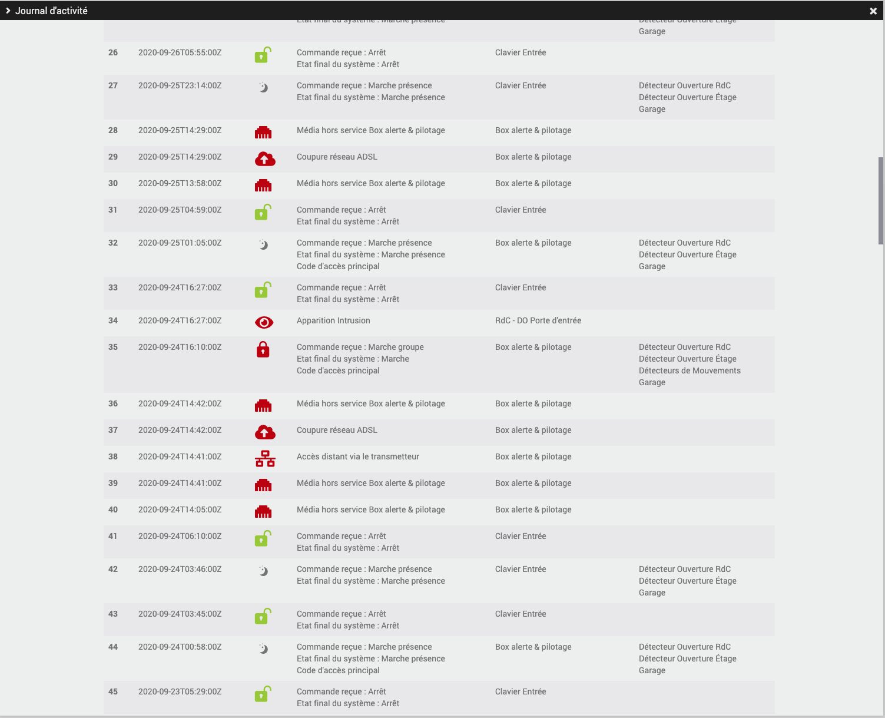

# Widget

Le plugin inclus un Widget qui permet de :
-   Connaitre le statut de l'alarme (y compris si une alarme est en cours)
-   Connaitre le nombre de mise à jour de l'alarme disponible
-   Activation totale de l'alarme
-   Activation partielle de l'alarme
-   Activation du mode présence
-   Désactivation totale de l'alarme
-   Désactivation partielle de l'alarme
-   Lancement d'un scénario

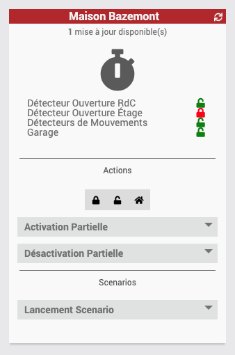

> Ce widget peut être désactivé dans la configuration de la centrale (seul équipement ayant pour le moment un widget personnalisé)

# HomeBridge

Le plugin est compatible avec HomeBridge (merci à Nebz l'auteur du plugin Homebridge) et vous permet ainsi de piloter votre alarme avec Homekit.

Toute la configuration se fait de façon automatique. Il vous suffit uniquement d'activer l'équipement dans HomeBridge et relancer le démon de HomeBridge.

Vous aurez ainsi ceci dans l'application "Domicile" de Homekit

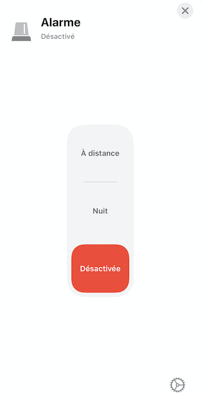

Voici la correspondance des modes HomeKit et des commandes du plugin :
* A distante : Activation Totale
* Nuit : Activation Mode Presence
* Désactivée : Désactivation Total

Les types génériques sont aussi positionnés pour les équipements Portail, Garage, Volets, Lumières

# Diagnostique

Le plugin inclus beaucoup de verbosité en mode DEBUG, il suffit alors de la configurer au niveau du plugin.
A partir de là, vous pouvez identifier les soucis que vous pouvez rencontrer.

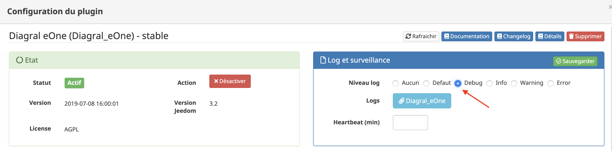

# Suivi d'installation

> Dans le cadre des plugins gratuit, Jeedom ne trace pas les installations ou tout du moins pas les utilisateurs du plugin.
>
> Cependant, à plusieurs reprise ces informations m'ont manqué car j'aurais voulu pouvoir faire un sondage rapide aux utilisateurs du plugin, ou envoyer une information.
> 
> Par conséquent, voulant avoir un moyen de contacter les utilisateurs du plugin, deux choix s'offrait à moi :
> -   passer le plugin payant
> -   développer un système me permettant de palier à ce manque
> 
> Vous l'aurez compris, j'ai pris le choix **Numero 2**.

Les informations envoyées au developpeur sont :
-   Clé unique de votre installation Jeedom (code généré par Jeedom)
-   Votre type de plateforme Jeedom
-   Votre login market
-   La version Jeedom
-   La [version](#numerotation-des-versions) du plugin Diagral-eOne
-   Votre adresse email (uniquement si vous la saisissez)

Vous pouvez choisir de désactiver l'envoi des informations ou bien n'envoyer que les informations anonymisées (clé unique Jeedom)

Vous avez aussi la possibilité de supprimer les informations stockés (action automatique à la désinstallation) en cliquant sur le bouton reservé à cet effet. Cette action désactive automatiquement l'envoi des données à venir.

Le login market permet de pouvoir vous contacter par [Community](https://community.jeedom.com) si besoin.

# Génération d'un package DiagDebug

> Afin de faciliter la collecte des informations nécessaires à l'analyse d'un problème, un bouton a était mis en place dans la configuration
> du plugin pour générer automatiquement une archive avec toutes les informations nécessaires.
> Cette archive est consultable après génération si vous souhaitez vérifier son contenu

Pour le générer il faut se rendre sur la page de configuration du plugin et cliquer sur le bouton __Générer un package de DiagDebug__

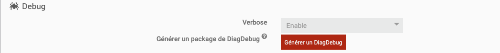

Au clic, en quelques secondes, une bannière apparait en vert en cas de succès, contenant le lien de téléchargement du DiagDebug Package

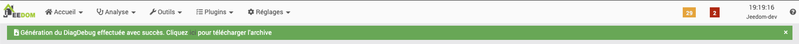

Si la bannière est rouge, cela indique un souci un souci de génération. Le message d'erreur dans la bannière donne plus de détail sur comment la résoudre.

# Numerotation des versions

La numérotation des versions est effectuée ainsi pour le moment :
- Premier chiffre : La version majeure du plugin (modification importante)
- Second chiffre : La version mineur du plugin (ajout de petite fonctionnalitées)
- Troisième chiffre : La version correctrice du plugin (résolution de bug)

# Roadmap

- Implémentation d'un webhook au sein du plugin pour permettre un refresh

> C'est aussi vous qui aller donner la direction que prendra ce plugin, donc je suis à votre écoute
> 
> Plus une fonctionnalité sera demandée (si elle est réalisable), plus elle sera prioritaire au développement (pondéré par sa difficulté d'integration).
> 
> Vous pouvez faire votre demande par en créant une demande "enhancement" [GitHub](https://github.com/mguyard/Jeedom-Diagral_eOne/issues/new) mais cela me fera plaisir si vous passez d'abord m'en parler sur le forum Jeedom.