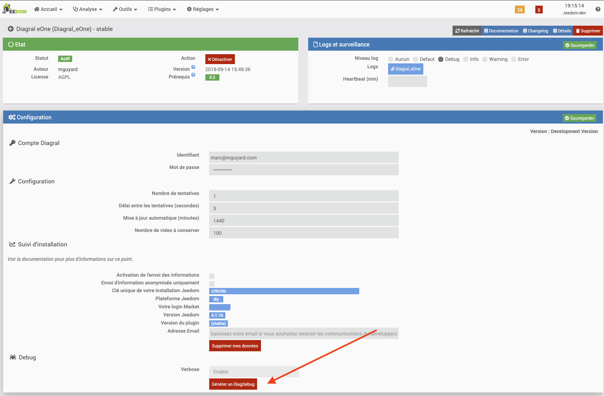
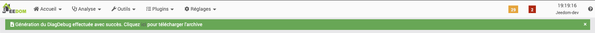

# Présentation 

Cette librairie PHP permet aux développeurs Jeedom d'intégrer la création de packages de diagnostique au sein de leur plugin Jeedom.
Ce package de diagnostique peut inclure des logs, le resultat de commande ou encore des fichiers.

# Que permet de faire la classe

La classe permet de générer une archive DiagDebug contenant toutes les informations que le developpeur du plugin Jeedom considère comme utile à un diagnostique.
L'objectif étant qu'un utilisateur de plugin, puisse facilement fournir une liste d'élément permettant au développeur d'investiguer sur un incident.

## Déclarer la construction d'un DiagDebug Package

La classe utilise la POO (Programmation Orienté Objet). Il faut l'initialiser comme l'exemple ci-dessous.

``$diag = new DiagDebug('Diagral_eOne', '/var/www/html/');``

_Paramètres :_
-   @param integer $pluginId - Jeedom plugin Id *
-   @param string $zipStorage - Optional Path to store DiagDebug Archive
-   @return void

Les anciens DiagDebug présent dans le repertoire sont supprimés

## Ajouter les logs du plugin

Ajoute automatiquement l'ensemble des logs du plugins dans le DiagDebug package

``diag->addPluginLogs();``

## Ajouter des logs Jeedom

### Unitairement

Pour ajouter un log Jeedom :

``$diag->addJeedomLog('update');``

_Paramètres :_
-   @param string $log - Log Name (without path) as show in Jeedom Logs interface *
-   @return void

### Plusieurs

Il est aussi possible d'en ajouter plusieurs en une fois au travers d'un autre méthode :

``$diag->addJeedomLogs(array('openvpn', 'starting'));``

_Paramètres :_
-   @param array $logs - Log Name (without path) as show in Jeedom Logs interface *
-   @return void

> _Cette méthode peut être appellée plusieurs fois._

## Ajouter le résultat de commande SHELL

### Unitairement

Il est possible d'ajouter le résultat d'une commande SHELL dans le DiagDebug package. 

__Chaque commande lancée ainsi génèrera un fichier de résultat portant le nom de la commande.__

``$diag->addCmd('ifconfig -a');``

_Paramètres :_
-   @param string $cmd - System command to run *
-   @param string $filename - Optional filename of result. If not specified, command will be use as result filename *
-   @param boolean $sudo - Optional to specify if command need to be run as sudo user
-   @return void

> _Cette méthode peut être appellée plusieurs fois._

### Plusieurs

Il est aussi possible d'appeler plusieurs commandes en même temps :

``$diag->addCmds(array('ls -l /tmp', 'ip addr'), 'GroupedCmds');``

__Cette méthode va créer un seul fichier contenant l'ensemble des résultats des commandes SHELL.__

_Paramètres :_
-   @param array $cmds - List of system commands to run *
-   @param string $filename - Filename where store commands results *
-   @param boolean $sudo - Optional to specify if command need to be run as sudo user
-   @return void

> _Cette méthode peut être appellée plusieurs fois._

## Ajouter la configuration du plugin

Il est possible d'ajouter la configuration du plugin dans le DiagDebug package. 

``$diag->addPluginConf();``

## Ajouter la liste des équipements du plugin

Il est possible d'ajouter la liste des équipements (avec des informations détaillées) du plugin dans le DiagDebug package. 

``$diag->addAllPluginEqlogic();``

## Ajouter des fichiers

# Unitairement

Il est possible d'ajouter un fichier dans le DiagDebug package. 

_Exemple 1:_
``$diag->addFile('/etc/hosts');``

_Exemple 2:_
``$diag->addFile('/var/www/html/plugins/Diagral_eOne/d*/p*');``

_Paramètres :_
-   @param string $file - File with absolute path. Can be a file, folder, or glob (wildcard) *
-   @return void

> _Cette méthode peut être appellée plusieurs fois._

### Plusieurs

Il est aussi possible d'ajouter plusieurs fichiers au travers d'un array et une autre méthode :

``$diag->addFiles(array('/var/www/html/robots.txt','/var/www/html/mobile.manifest.php'));``

_Paramètres :_
-   @param array $files - Files with absolute path. Can be a file, folder, or glob (wildcard) *
-   @return void

> _Cette méthode peut être appellée plusieurs fois._

## Récuperer l'archive DiagDebug

La methode suivante permet de récupérer les informations concernant le DiagDebug package généré afin de pouvoir le récupérer

``$diag->download();``

_Paramètres :_
* @return array - with filename, filesize, absolutePath and relativePath (after the Jeedom base URL)

# Comment l'intégrer ?

Voici un petit tutoriel pas-à-pas permettant de vous aider à intégrer cette classe dans votre plugin Jeedom.

## Ajoutez la classe dans votre plugin

Placer la lib dans votre répertoire 3rdparty

## Déclarez la dans la classe core de votre plugin

Après la déclaration du core Jeedom
    require_once __DIR__  . '/../../../../core/php/core.inc.php';

Ajoutez ce code avant la déclaration de votre classe

    define('__PLGBASE__', dirname(dirname(__DIR__)));
    require_once (__PLGBASE__.'/3rparty/DiagDebug/DiagDebug.class.php');

### Dans la page configuration.php de votre plugin

Ajoutez un bouton pour générer le DiagDebug Package

    

        

        

            <button type="button" id="generateDiagDebug" class="btn btn-danger btn-lg">Générer un DiagDebug</button>
        

    

Puis ajoutez un bout de code JS pour lancer une action lors du clic sur le bouton

    // Génère le package DiagDebug
    $('#generateDiagDebug').click( function() {
        $.ajax({// fonction permettant de faire de l'ajax
            type: "POST", // methode de transmission des données au fichier php
            url: "plugins/Diagral_eOne/core/ajax/Diagral_eOne.ajax.php", // url du fichier php
            data: {
                action: "generateDiagDebug",
            },
            dataType: 'json',
            error: function (request, status, error) {
                handleAjaxError(request, status, error);
            },
            success: function (data) { // si l'appel a bien fonctionné
                if (data.state != 'ok') {
                    $('#div_alert').showAlert({message: data.result, level: 'danger'});
                    return;
                }
                $('#div_alert').showAlert({message: '{{<i class="fas fa-file-download"></i> Génération du DiagDebug effectuée avec succès. Cliquez <a href="' + data.result.relativePath + '" target="_blank" download>ici</a> pour télécharger l\'archive}}', level: 'success'});
            }
        });
    });

Ce code appelle en AJAX le fichier xx.ajax.php dans le /core/ajax de votre plugin

### La configuration du fichier AJAX

Ce code permet de spécifier quelle méthode est lancée (ici dans l'exemple, la méthode generateDiagDebug dans la classe du plugin Diagral_eOne)

    try {
    [...]

        // Génératon d'une archive de DiagDebug
        if (init('action') == 'generateDiagDebug') {
            try {
                $diagDebug = Diagral_eOne::generateDiagDebug();
                ajax::success($diagDebug);
            } catch (Exception $e) {
                ajax::error(displayExeption($e), $e->getCode());
            }
        }

    [...]
    } catch (Exception $e) {
        ajax::error(displayException($e), $e->getCode());
    }

Il faut désormais créer la méthode dans le classe Core de votre plugin.

### Création de la méthode dans la classe Core du votre plugin

    public function generateDiagDebug() {
        try {
            $diag = new DiagDebug('Diagral_eOne');
            $diag->addPluginLogs();
            $diag->addJeedomLogs(array('plugin', 'jeedom', 'http.error'));
            $diag->addCmd('nslookup appv3.tt-monitor.com');
            $diag->addCmd('ip addr', NULL, TRUE);
            $diag->addCmd('ip route', NULL, TRUE);
            $diag->addCmd('ls -lR #PLUGBASE#', NULL, TRUE);
            $diag->addPluginConf();
            $diag->addAllPluginEqlogic();
            $diag->addFile('#PLUGBASE#');
            return $diag->download();
        } catch (Exception $e) {
            echo 'Exception reçue : '.  $e->getMessage() . ' ';
        }
    }

C'est dans cette méthode que vous pouvez mettre toutes les actions possibles de la classe telle que détaillé plus haut.

# Comment l'utilisateur l'utilise

Il se rend sur la page de configuration du plugin et clique sur le bouton que vous avez mis en place

Au clic, en quelques secondes, une bannière apparait en vert en cas de succès, contenant le lien de téléchargement du DiagDebug Package

Si la bannière est rouge, cela indique un souci. Le message d'erreur dans la bannière donne plus de détail sur comment la résoudre.