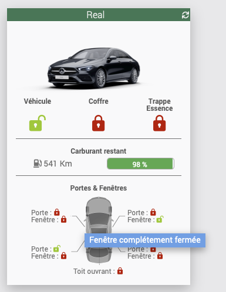

# Présentation 

Ce plugin a pour but de permettre de récuperer dans Jeedom les informations de sa Mercedes.
Il se base sur les API misent à disposition par Mercedes à l'adresse [https://developer.mercedes-benz.com](https://developer.mercedes-benz.com)

Actuellement Mercedes ne propose pas encore beaucoup de possibilitées avec son API __BRING YOUR OWN CAR (BYOC)__ (tout du moins, moins qu'avec l'application Mobile) mais il évoluera au mieux possible.

# Principe 

Mercedes propose uniquement une méthode Cloud d'interraction avec votre voiture, par conséquent ce plugin utilise une connexion internet pour interragir avec celle-ci.

C'est donc une interface __CLOUD__

# Installation et configuration du plugin

Installer le plugin sur votre Jeedom et activez le.

Afin de permettre au plugin de collecter les informations sur le Cloud Mercedes, un certains nombre de droits doivent être défini sur votre compte Mercedes.
Pour cela, connectez-vous sur [https://developer.mercedes-benz.com](https://developer.mercedes-benz.com) avec votre compte mercedes utilisé sur l'application mobile.

## Création de l'application

Aller dans la [console](https://developer.mercedes-benz.com/console) et créez une nouvelle application avec le bouton "+ ADD NEW APP"
Les champs sont a remplir ainsi :
-   Application Name : Mettre ce que vous souhaitez
-   Purpose URL : Laisser vide
-   Business Purpose : Mettre __Request my car informations__
-   Note : Laisser vide

Il devrait a partir de là, vous afficher l'APP ID.

## Ajout des APIs

Se rendre à l'adresse [dans la liste des API](https://developer.mercedes-benz.com/apis).
La liste des API a activer sont :
-   Vehicle Status
-   Vehicle Lock Status
-   Fuel Status (Seulement pour les __véhicules non-électrique__)
-   Electric Vehicle Status (seulement pour les __véhicules électriques__)

Pour activer les API, il faut procéder ainsi :
-   Cliquer sur le __bouton "TRY IT NOW"__ de l'API concernée
-   Puis sur le __bouton "> GET ACCESS"__
-   Choisir l'option __BRING YOUR OWN CAR__ puis cliquez sur __NEXT__ 
-   Cliquez sur __NEXT__
-   Selectionnez votre application créé précédement et cliquez sur __NEXT__
-   Ne modifiez rien et cliquez sur __SUBMIT__

### Cas particulier : API Vehicle Images

Il faut aussi activer l'API :
-   Vehicle Images

Cependant cette API ne fait pas parti de BYOC et donc son activation est un peu différente car c'est en fait une version d'essai limité à 5 tentatives.

Le plugin utilise cette API pour afficher une image de votre voiture sur l'équipement Jeedom.

Dans le cas où l'image ne pourrait être récupéré lors de cette version d'essai, elle est remplacé par une image standard (placeholder).

Pour activer cette API :
-   Cliquer sur le __bouton "TRY IT NOW"__ de l'API concernée
-   Puis sur le __bouton "> GET ACCESS"__
-   Choisir l'option __TEST THIS PRODUCT__ puis cliquez sur __NEXT__ 
-   Choisir __360°__ et cliquez sur __NEXT__
-   Selectionnez votre application créé précédement et cliquez sur __NEXT__
-   Ne modifiez rien et cliquez sur __SUBMIT__

## Configuration de l'application

Aller dans la [console](https://developer.mercedes-benz.com/console) et editez le champ __Redirect URLs__ afin de remplacer le https://localhost

Vous trouverez l'url à y saisir dans le champs __Redirect URLs__ de la configuration du plugin.

> Format de l'URL :
>
> _https://\<votre IP ou DNS public\>:\<port\>/plugins/Mercedes_me/core/php/callback.php?apikey=\<API Key\>_

## Configuration du plugin

Rendez-vous dans la page de configuration du plugin Mercedes Me et remplissez les champs :
-   Identifiant : Votre email de compte Mercedes
-   Mot de passe : Votre mot de passe de compte Mercedes
-   Client ID : A retrouver dans votre application Mercedes dans la [console](https://developer.mercedes-benz.com/console)
-   Client Secret : A retrouver dans votre application Mercedes dans la [console](https://developer.mercedes-benz.com/console)
-   API Key : A retrouver dans votre application Mercedes dans la [console](https://developer.mercedes-benz.com/console)

Cliquez sur __Sauvegarder__ pour enregistrer les informations saisies puis sur le bouton __Activer/Refaire la connexion Mercedes__

> Dès lors le plugin va établir la communication avec le Cloud Mercedes. Pour cela il utilise le protocole OAUTH2 qui necessite que vous saisissiez votre identifiant et mot de passe Mercedes ainsi que vous acceptiez l'utilisation des API en les cochant (fait une seule fois normalement).
> 
> Vous êtes ensuite redirigé à nouveau vers la configuration du plugin.
> 
> A partir de la, vous avez désormais dans la partie Debug, les informations montrant que la connexion est bien active et opérationnelle.

## Création de votre véhicule dans Jeedom

Dans Jeedom, aller dans __Plugins -> Objets connectés -> Mercedes Me__
-   Cliquez sur Ajouter
-   Définissez un nom à votre Equipement
-   Choissiez un objet Parent et une catégorie
-   Saisissez le VIN de votre véhicule (visible sur votre carte grise dans le champs E)

# Affichage sur le Dashboard

Le plugin inclus un widget qui vous donne visuellement un retour sur les informations récoltés
> Afin d'avoir l'image personnalisé de votre véhicule sur le widget, il faut lancer la commande __Telecharger Vehicule Image__ qui la récupèrera et la stockera dans le plugin.
> 
> __ATTENTION :__ Le récupération automatique n'est pour le moment pas activé car Mercedes limite à 5 requêtes par véhicule la récupération d'image. Afin d'eviter les échecs et atteindre la limite, je laisse l'utilisateur la récupérer manuellement quand il considère que le plugin est opérationnel. 

 

> Afin de profiter des couleurs, il vous faut avoir l'option __Icônes widgets colorées__ active dans la configuration de votre Jeedom
> 
> Réglages > Système > Configuration > Interface > Tuile

Les fenêtres et Toit ouvrant / Capote pouvant avoir des statuts plus précis que ouvert ou fermé, vous avez le detail en placant la souris sur l'icône correspondant

# Rafraichissement

Une particularité du Cloud Mercedes est :
-   qu'il ne récupère les données qui si il y a changement
-   qu'il ne récupère __QUE__ la donnée qui a changé et non pas toutes
-   qu'il ne stock les données que 12 heures.

Par conséquent, pour recevoir une valeur, il faut qu'il y ai eu un changement d'état dans les 12h précédente. Donc a l'installation du plugin, il se peut que vous ne récupériez pas l'ensemble des informations.
Dans ce cas, si vous le souhaitez, je vous invite a ouvrir toutes les portes, fenêtres, capotes, toit ouvrant et rouler un peu pour récupérer les informations de charge (si voiture electrique) ou de carburant.

## Automatique

Une tâche CRON est automatiquement créée sur base du délai de 5 minutes.

## Manuel

Dans un scénario, vous pouvez utiliser la commande __Rafraichir__ afin de reforcer un refresh des informations.

# Commandes

Il existe actuellement plusieurs commandes qui sont décrites ci-dessous :

## Action

-   __Rafraichir__ : Mise à jour des informations du véhicule
-   __Telecharger Vehicule Image__ : Télécharge une image de votre véhicule pour l'utiliser sur le Widget (attention Mercedes autorise uniquement 5 requètes par véhicule. Le plugin recupère l'image et l'utilise si elle exixte pour limiter les requètes)

## Infos

La plupart des commandes d'informations sont des commandes qui retourne un résultat binaire (0 : Non-Fermé / 1 : Oui-Ouvert) sauf informtion contraire ci-dessous :

-   __Verrouillage du vehicule__ : Indique si le véhicule est vérrouillé. Retourne une valeur numérique
    -   0: vehicle ouvert
    -   1: vehicle fermé de l'interieur
    -   2: vehicle fermé de l'exterieur
    -   3: vehicle fermé partiellement
-   __Verrouillage de la trappe Essence__ (uniquement pour les véhicules non-éléctrique)
-   __Essence - Nombre de Km restant__ (uniquement pour les véhicules non-éléctrique) : Retourne l'estimatif du nombre de kilomètre restant dans le reservoir
-   __Essence - Pourcentage restant__ (uniquement pour les véhicules non-éléctrique) : Retourne le pourcentage de reservoir restant
-   __Electrique - Nombre de Km restant__ (uniquement pour les véhicules éléctrique)
-   __Electrique - Pourcentage Charge Restante__ (uniquement pour les véhicules éléctrique)
-   __Statut Porte Avant Gauche__
-   __Statut Porte Avant Droite__
-   __Statut Porte Arriere Gauche__
-   __Statut Porte Arriere Droite__
-   __Statut Fenetre Avant Gauche__
    -   0: Fenêtre en position intermédiaire
    -   1: Fenêtre complétement ouverte
    -   2: Fenêtre complétement fermée
    -   3: Fenêtre en position d'aération
    -   4: Fenêtre en position d'aération intermédiaire
    -   5: Fenêtre en mouvement
-   __Statut Fenetre Avant Droite__
    -   0: Fenêtre en position intermédiaire
    -   1: Fenêtre complétement ouverte
    -   2: Fenêtre complétement fermée
    -   3: Fenêtre en position d'aération
    -   4: Fenêtre en position d'aération intermédiaire
    -   5: Fenêtre en mouvement
-   __Statut Fenetre Arriere Gauche__
    -   0: Fenêtre en position intermédiaire
    -   1: Fenêtre complétement ouverte
    -   2: Fenêtre complétement fermée
    -   3: Fenêtre en position d'aération
    -   4: Fenêtre en position d'aération intermédiaire
    -   5: Fenêtre en mouvement
-   __Statut Fenetre Arriere Droite__
    -   0: Fenêtre en position intermédiaire
    -   1: Fenêtre complétement ouverte
    -   2: Fenêtre complétement fermée
    -   3: Fenêtre en position d'aération
    -   4: Fenêtre en position d'aération intermédiaire
    -   5: Fenêtre en mouvement
-   __Statut Toit Ouvrant__
    -   0 : Le toit ouvrant inclinable et coulissant est fermé
    -   1 : Le toit ouvrant inclinable et coulissant est complètement ouvert
    -   2 : Le toit levant est ouvert
    -   3 : Le toit ouvrant inclinable et coulissant est en mouvement
    -   4 : Le toit ouvrant inclinable et coulissant en position anti-balancement
    -   5 : Le toit coulissant en position intermédiaire
    -   6 : Le toit relevable en position intermédiaire
-   __Statut Capote__ (uniquement pour les cabriolets)
    -   0 : Capote déverrouillée
    -   1 : Capote ouverte et verrouillée
    -   2 : Capote fermée et verrouillée
-   __Verrouillage du coffre__
-   __Etat d'ouverture du coffre__