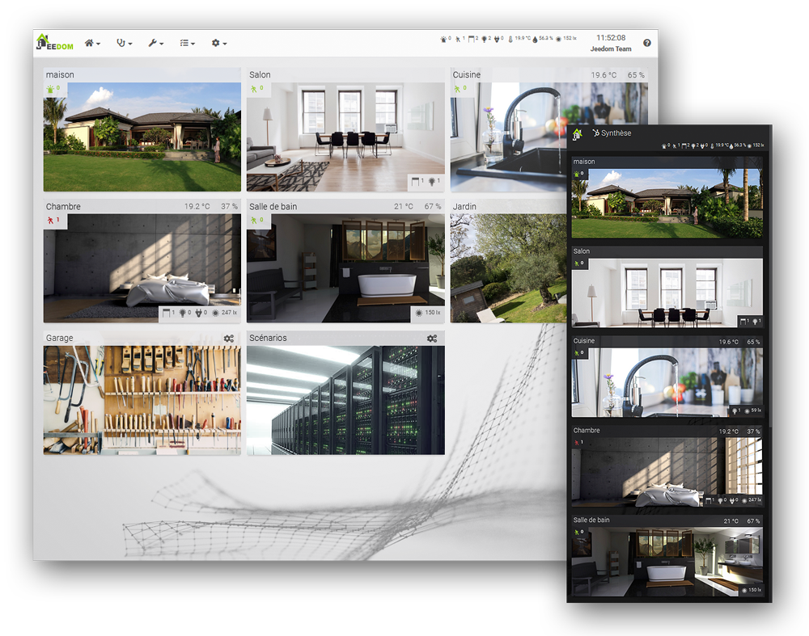

### Documentation des plugins Jeedom de Mguyard

Bienvenue sur le site de documentation des pluginns Jeedom de Mguyard.

# Liste des plugins 

* [Diagral eOne](Diagral_eOne/) (STABLE)
* [Mercedes Me](Mercedes_Me/) (DEVEL)

*Cette documentation est également accessible depuis votre plugin Jeedom.*
