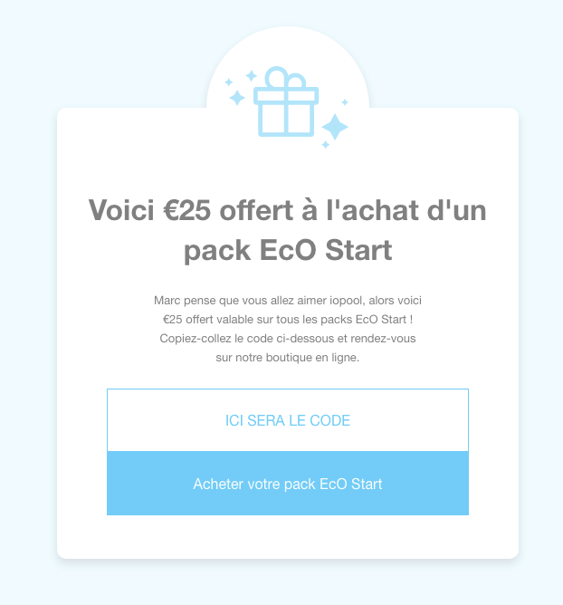

# Présentation 

[iopool](https://iopool.com/) est une société belge qui propose une sonde connectée (EcO) sans abonnement pour vous aider à gérer votre __Piscine ou Spa__.

Outre la sonde, iopool c'est aussi une [application mobile](https://iopool.com/fr/lapplication-mobile/), [produits d'entretien](https://iopool.com/fr/produits-chimiques/) et des [accessoires](https://shop.iopool.com/fr/collections/accessories) pour piscine.

# Principe du plugin

La sonde iopool est uniquement compatible Bluetooth et l'ensemble des informations et actions sont disponible directement dans l'application mobile iopool lorsque vous êtes à portée du bluetooth. Ces données sont ensuite transmise par l'application au cloud iopool.

Cependant, iopool propose un [relais Bluetooth/Wifi](https://shop.iopool.com/fr/collections/accessories/products/relais-wi-fi) que vous laissez à portée Bluetooth de la piscine et qui permet de collecter les données de la sonde EcO et les transmettre en wifi vers le cloud iopool. Ainsi depuis n'importe où, vous pouvez accéder aux informations de votre piscine avec votre application mobile iopool et qu'avec votre Jeedom.

Ce plugin est donc une interface avec le __CLOUD iopool__

# Pré-requis/Recommandation

L'utilisation d'un [relais Bluetooth/Wifi](https://shop.iopool.com/fr/collections/accessories/products/relais-wi-fi) est une recommandation au fonctionnement du plugin.

En effet, si vous ne possedez pas de relais, les données que le plugin pourra afficher, seront uniquement les données que votre application aura collecter en Bluetooth.
Il est donc recommandé d'utiliser la sonde pour avoir des données plus régulières sans devoir ouvrir votre application. 

# Economisez de l'argent avec le parrainage iopool

Si vous n'êtes pas encore client iopool et que vous souhaitez acquérir la sonde EcO, je vous propose (mon lien de parrainage)[https://refrr.app/JAubi4Lx7y/58728] qui vous fera __économiser 25 Euros__ pour l'achat d'un [EcO Start](https://shop.iopool.com/fr/collections/start-packs/products/eco-start) (pack incluant la sonde, et des 3Kg produits pour démarrer votre Piscine ou Spa). Ainsi le pack EcO Start vous reviendra à 174€ au lieu de 199€

> De mon coté je recevrais aussi un bon d'achat de 25 Euros. Un moyen qui ne vous coûte rien (qui vous fait même gagner 25 Euros) et qui permettra de soutenir le développement du plugin.

 Pour profiter des 25 euros de réduction, rien de plus simple :
- Cliquez sur [le lien de parrainage](https://refrr.app/JAubi4Lx7y/58728)
- Une fenêtre "pop-up" s'ouvre après quelques secondes (soyez patient pour mériter les 25€), vous invitant à créer un compte
- Une fois votre compte créé, vous devriez voir une fenêtre pop-up avec votre code de réduction
- Une fois votre code de réduction reçu et copié, vous pouvez ajouter votre pack EcO Start dans le panier, valider votre achat, sans oublier d'indiquer votre code de réduction avant de procéder au paiement.

> Si vous avez déjà un compte iopool mais n'avez jamais commandé, contacter le support pour demander la supression de votre compte afin que vous puissiez créer un nouveau compte et profiter du bon de reduction (Note: vous pouvez aussi créer un compte avec une nouvelle adresse email).

# Installation et configuration du plugin

Installer le plugin sur votre Jeedom et activez le.
Une fois actif, vous devez saisir dans la configuration du plugin, votre clé API ainsi que le paramètre de température.

## Avoir votre clé API

Faite simplement une demande au support iopool au travers de votre application mobile : Plus > Support > Envoyez-nous un message

# Affichage sur le dashboard

Le plugin inclus un widget qui vous donne visuellement un retour sur les informations récoltés

# Rafraichissement

## Automatique

Une tâche CRON est automatiquement créée et s'execute toute le 15 minutes.

## Manuelle

Dans un scénario, vous pouvez utiliser la commande Rafraichir afin de reforcer un refresh des informations.
Un bouton de refresh est aussi disponible en haut à droite du widget.

# Commandes

> Actuellement le plugin utilise toutes les commandes disponible par l'API iopool

Il existe actuellement plusieurs commandes qui sont décrites ci-dessous :

## Action

* __Rafraichir__ : Mise à jour des informations de la sonde EcO

## Info

* __Mode de la sonde__ : Permet de connaitre le mode de la sonde (STANDARD / OPENING / WINTER / INITIALISATION)
* __Etat général__ : Permet de d'extrapoler a partir des informations collecté le fameux drapeau présent sur l'application iopool
* __Action requise__ : Permet de savoir si une action est requise (1) ou non (0). L'API ne fournit pas la liste des actions
* __Temps de filtration recommandé__ : Depuis la version 2.9.0, iopool affiche un temps de filtration recommandé basé sur le débit de la pompe, le volume d'eau et la température de votre piscine. Ideal pour l'utiliser dans un scenario qui déclenche votre pompe, vous saurez maintenant quand l'arréter avec une valeure dynamique.
* __Dernière mesure - Temperature__ : Température d'eau relevé par la sonde EcO
* __Dernière mesure - pH__ : Mesure pH de la sonde EcO
* __Dernière mesure - orp__ : Mesure de la capacité de désinfection
* __Dernière mesure - mode de reception__ : Mode de reception de la valeur (standard = application / gateway = Relais Bluetooth/Wifi)

# Numerotation des versions

La numérotation des versions est effectuée ainsi pour le moment :
- Premier chiffre : La version majeure du plugin (modification importante)
- Second chiffre : La version mineur du plugin (ajout de petite fonctionnalitées)
- Troisième chiffre : La version correctrice du plugin (résolution de bug)

# Roadmap