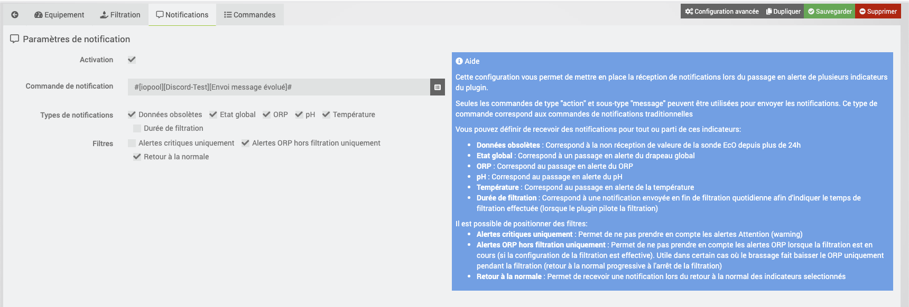

# Présentation 

[iopool](https://iopool.com/) est une société belge qui propose une sonde connectée (EcO) sans abonnement pour vous aider à gérer votre __Piscine ou Spa__.

Outre la sonde, iopool c'est aussi une [application mobile](https://iopool.com/fr/lapplication-mobile/), [produits d'entretien](https://iopool.com/fr/produits-chimiques/) et des [accessoires](https://shop.iopool.com/fr/collections/accessories) pour piscine.

# Principe du plugin

La sonde iopool est uniquement compatible Bluetooth et l'ensemble des informations et actions sont disponibles directement dans l'application mobile iopool lorsque vous êtes à portée du bluetooth. Ces données sont ensuite transmises par l'application au cloud iopool.

Cependant, iopool propose un [relais Bluetooth/Wifi](https://shop.iopool.com/fr/collections/accessories/products/relais-wi-fi) que vous laissez à portée Bluetooth de la piscine et qui permet de collecter les données de la sonde EcO et les transmettre en wifi vers le cloud iopool. Ainsi depuis n'importe où, vous pouvez accéder aux informations de votre piscine avec votre application mobile iopool et qu'avec votre Jeedom.

Ce plugin est donc une interface avec le __CLOUD iopool__

# Pré-requis/Recommandation

L'utilisation d'un [relais Bluetooth/Wifi](https://shop.iopool.com/fr/collections/accessories/products/relais-wi-fi) est une recommandation au fonctionnement du plugin.

En effet, si vous ne possédez pas de relais, les données que le plugin pourra afficher, seront uniquement les données que votre application aura collectées en Bluetooth.
Il est donc recommandé d'utiliser la sonde pour avoir des données plus régulières sans devoir ouvrir votre application. 

# Economisez de l'argent avec le parrainage iopool

Si vous n'êtes pas encore client iopool et que vous souhaitez acquérir la sonde EcO, je vous propose (mon lien de parrainage)[https://refrr.app/JAubi4Lx7y/58728] qui vous fera __économiser 25 Euros__ pour l'achat d'un [EcO Start](https://shop.iopool.com/fr/collections/start-packs/products/eco-start) (pack incluant la sonde, et 3Kg de produits pour démarrer votre Piscine ou Spa). Ainsi le pack EcO Start vous reviendra à 174€ au lieu de 199€

> De mon côté, je recevrai aussi un bon d'achat de 25 Euros. Un moyen qui ne vous coûte rien (qui vous fait même gagner 25 Euros) et qui permettra de soutenir le développement du plugin.

 Pour profiter des 25 euros de réduction, rien de plus simple :
- Cliquez sur [le lien de parrainage](https://refrr.app/JAubi4Lx7y/58728)
- Une fenêtre "pop-up" s'ouvre après quelques secondes (soyez patient pour mériter les 25€), vous invitant à créer un compte
- Une fois votre compte créé, vous devriez voir une fenêtre pop-up avec votre code de réduction
- Une fois votre code de réduction reçu et copié, vous pouvez ajouter votre pack EcO Start dans le panier, valider votre achat, sans oublier d'indiquer votre code de réduction avant de procéder au paiement.

> Si vous avez déjà un compte iopool mais n'avez jamais commandé, contactez le support pour demander la suppression de votre compte afin que vous puissiez créer un nouveau compte et profiter du bon de réduction (Note: vous pouvez aussi créer un compte avec une nouvelle adresse email).

# Installation et configuration du plugin

Installer le plugin sur votre Jeedom et activez le.
Une fois actif, vous devez saisir dans la configuration du plugin, votre clé API ainsi que le paramètre de température.

## Avoir votre clé API

Faites simplement une demande au support iopool au travers de votre application mobile : Plus > Support > Envoyez-nous un message

# Découverte des sondes

Pour découvrir l'ensemble des sondes de votre compte, aller dans le plugin et cliquez sur "Synchronisation".
L'ensemble des sondes vont être créées.

> Par défaut, les sondes sont créées pour une utilisation __Piscine__. Si vous l'utilisez au sein d'un SPA, éditez l'équipement pour le configurer en tant que type SPA. Ainsi les seuils de températures seront ajustées sur le widget du dashboard.

# Affichage sur le dashboard

Le plugin inclut un widget qui vous donne visuellement un retour sur les informations récoltées

# Rafraichissement

## Automatique

Une tâche CRON est automatiquement créée et s'exécute toute les 5 minutes.

> Afin de ne pas surcharger le cloud iopool de requetes simultanées, un temps d'attente aléatoire entre 0 et 60 secondes s'ajoute lors du lancement du rafraichissement automatique des données
> Ce temps d'attente n'est ajouté qu'une seule fois même si l'on a plusieures sondes.

## Manuelle

Dans un scénario, vous pouvez utiliser la commande Rafraichir afin de reforcer un refresh des informations.
Un bouton de refresh est aussi disponible en haut à droite du widget.

# Commandes

> Actuellement le plugin utilise toutes les commandes disponible par l'API iopool

Il existe actuellement plusieurs commandes qui sont décrites ci-dessous :

## Action

* __Rafraichir__ : Mise à jour des informations de la sonde EcO

## Info

* __Mode de la sonde__ : Permet de connaitre le mode de la sonde (STANDARD / OPENING / WINTER / INITIALISATION)
* __Etat général__ : Permet d'extrapoler à partir des informations collectées le fameux drapeau présent sur l'application iopool (GREEN / ORANGE / RED)
* __Action requise__ : Permet de savoir si une action est requise (1) ou non (0). L'API ne fournit pas la liste des actions
* __Temps de filtration recommandé__ : Depuis la version 2.9.0, iopool affiche un temps de filtration recommandé basé sur le débit de la pompe, le volume d'eau et la température de votre piscine. Idéal pour l'utiliser dans un scénario qui déclenche votre pompe, vous saurez maintenant quand l'arrêter avec une valeur dynamique.
* __Dernière mesure - Temperature__ : Température d'eau relevée par la sonde EcO
* __Dernière mesure - pH__ : Mesure pH de la sonde EcO
* __Dernière mesure - orp__ : Mesure de la capacité de désinfection
* __Dernière mesure - mode de reception__ : Mode de réception de la valeur (standard = application / gateway = Relais Bluetooth/Wifi)

# Notifications

> __FONCTIONNALITE DISPONIBLE UNIQUEMENT EN BETA A PARTIR DE v1.1.0__

Le plugin permet de générer des notifications lorsque certains indicateurs passe en warning ou critical.
Pour le configurer, un nouvel onglet est disponible sur l'équipement.

> L'envoi de notification s'appui sur un plugin tiers configurable (DiscordLink, Telegram, etc...)
> 
> Seul les commandes de type "action" et sous-type "message" peuvent être utilisé pour envoyer les notifications. Ce type de commande correspond généralement aux commandes de notification traditionnelles

Vous pouvez définir de recevoir des alertes pour tout ou parti de ces indateurs:
* __Données obsolètes__ : Correspond à la non réception de valeure de la sonde eCo depuis plus de 24h
* __Etat global__ : Correspond à un passage en alerte du drapeau global
* __ORP__ : Correspond au passage en alerte du ORP
* __pH__ : Correspond au passage en alerte du pH
* __Température__ : Correspond au passage en alerte de la température

Il est possible de positionner des filtres:
* __Alertes critiques uniquement__ : Permet de ne pas prendre en compte les alertes Attention (warning)
* __Retour à la normale__ : Permet de recevoir une notification lors du retour à la normal des indicateurs selectionnés

# Historisation

Les commandes suivantes sont historisées par défaut :
* __Dernière mesure - Temperature__
* __Dernière mesure - pH__
* __Dernière mesure - orp__

Afin que les valeurs ne soient pas moyennées dans l'historique, le plugin force que l'historisation Jeedom de ces commandes ne soient pas lissées.
Ainsi les valeurs affichées dans l'historique correspondent bien aux valeurs collectées.
Dans le cas contraire, par défaut Jeedom fait une moyenne toutes les 5 minutes des valeurs et donc sera moins précis.

L'inconvénient est que donc plus de valeurs peuvent être stockées et donc consommer plus de place en base de données (qui a un impact à terme sur l'espace disque dur).

Si vous souhaitez changer ce comportement, il suffit de suivre ce [tutoriel](https://jeedomiser.fr/article/historiser-vos-commandes/#Mode_de_lissage) pour remettre un lissage par défaut (moyenne). L'article est globalement très interessant à lire pour votre culture de l'historisation au sein de Jeedom.

# Numerotation des versions

La numérotation des versions est effectuée ainsi pour le moment :
- Premier chiffre : La version majeure du plugin (modifications importantes)
- Second chiffre : La version mineure du plugin (ajout de petites fonctionnalités)
- Troisième chiffre : La version correctrice du plugin (résolution de bugs)

# Roadmap
