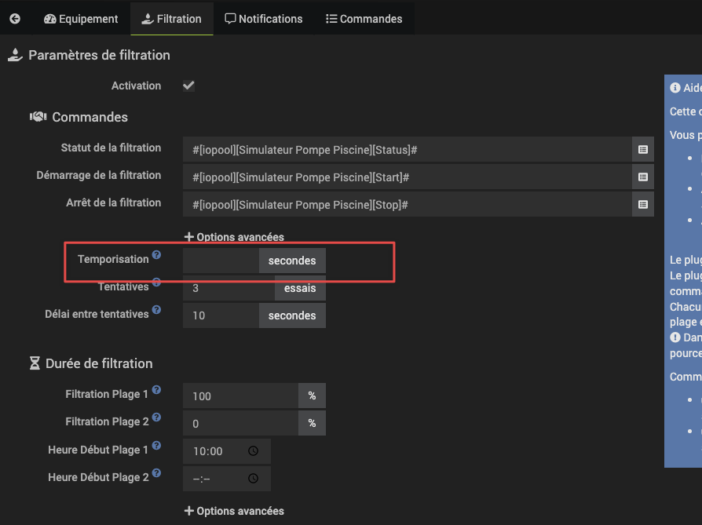

# Filtration

## Le plugin m'indique que les commandes de filtration n'ont pas pu être executée

Il est possible parfois que la mise à jour du statut de votre filtration se fasse plus tardivement que la verification du plugin.
Pour palier à cela, vous pouvez configurer une temporisation dans les options avancées

Il vous suffit en général de mettre 1 à 2 secondes pour résoudre le problème

# Widget

## La température du widget ne s'affiche pas dans la bonne couleur

Les seuils de couleur sont différents que l'on utilise sa sonde pour une piscine ou un SPA.
Vérifiez que vous avez bien configuré dans le plugin, le type de la sonde en piscine (par défaut) ou SPA selon votre usage.

## J'ai la filtration active dans le plugin mais le widget m'affiche seulement le bouton Off ou le bouton On pour la filtration

Jeedom ne supporte pas d'avoir 2 widgets qui utilisent les même commandes (statut, on et off). Par conséquent, si vous avez l'équipement d'origine des commandes ou un virtuel utilisant ces commandes, il ne faut pas l'afficher.
Cela n'a d'autant plus pas d'intêrets car le widget du plugin affiche deja le statut et permet d'allumer ou arrêter la pompe.

Afin de confirmer ce cas, il faut mettre l'équipement iopool dans une pièce vide et n'afficher que cette pièce sur le dashboard. Si le problème n'est plus présent, vous êtes bien dans ce cas.

## J'ai la filtration active dans le plugin mais le widget ne met pas à jour l'état de fonctionnement de la pompe

Je vous invite à lire le point précédent